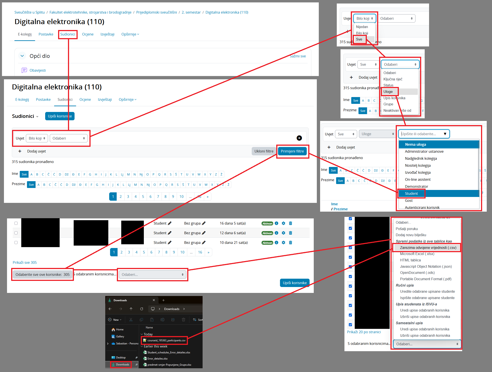
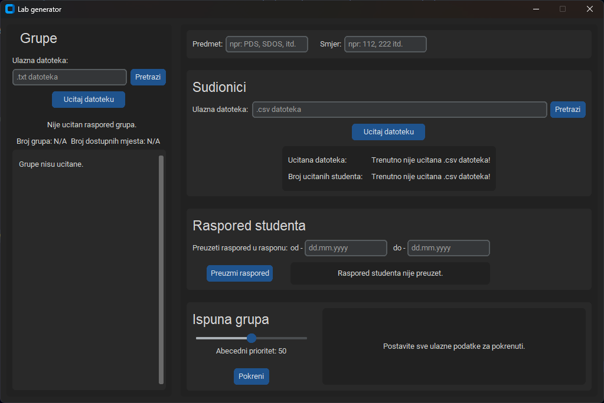
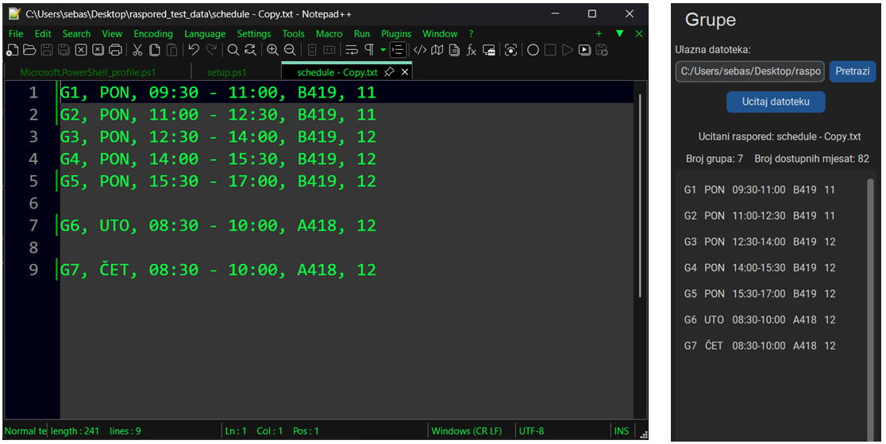
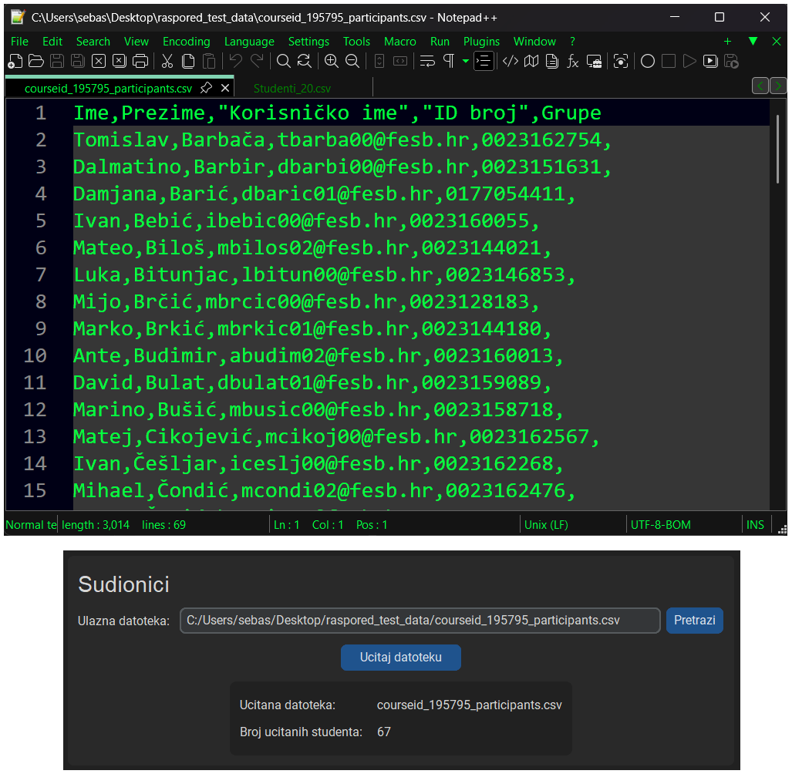
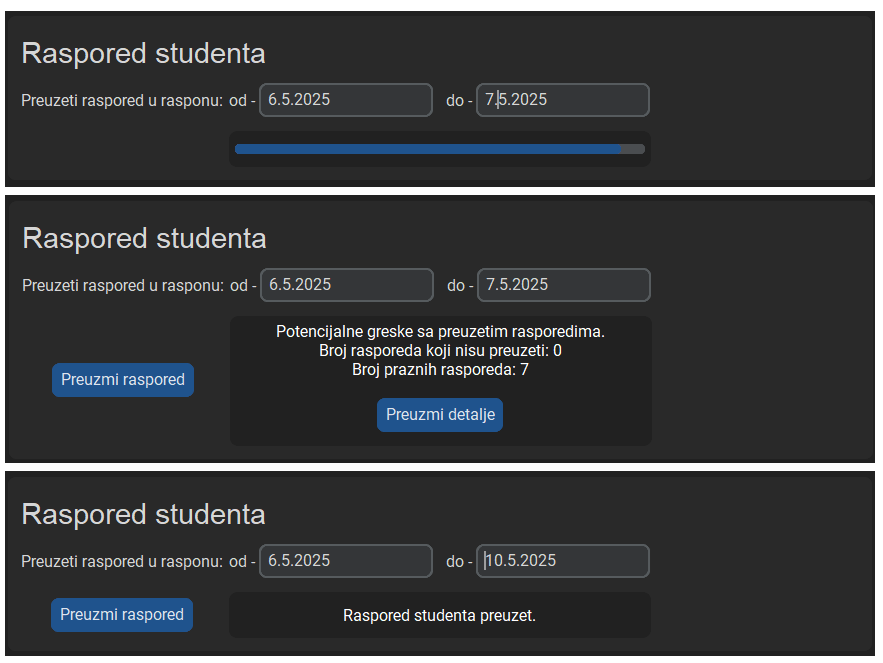
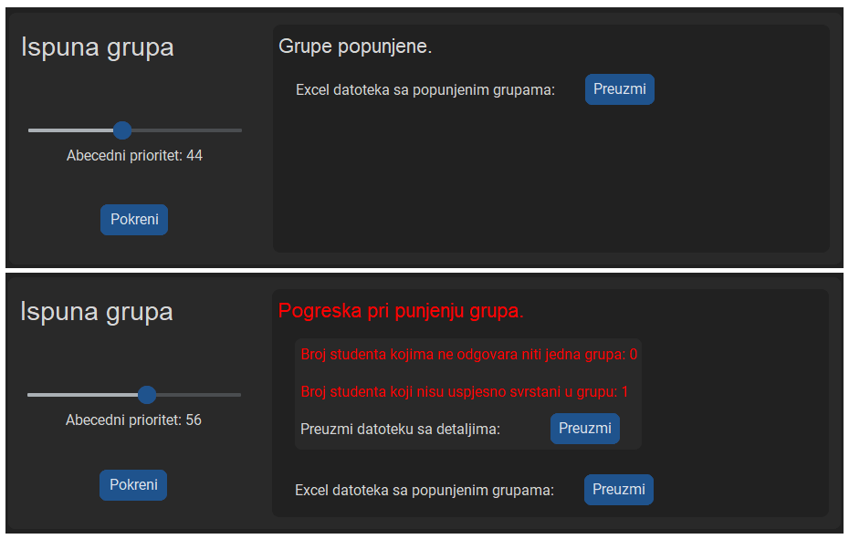

<a id="readme-top"></a>

# Lab-Generator

<details>
  <summary>Sadrzaj</summary>
  <ol>
    <li><a href="#opis-programa">Opis programa</a></li>
    <li><a href="#instaliranje-programa">Instaliranje programa</a></li>
    <li><a href="#poznate-greške">Poznate greške</a></li>
    <li><a href="#u-planu">U planu</a></li>
    <li>
      <a href="#koristenje">Koristenje</a>
      <ul>
        <li><a href="#priprema-ulaznih-podataka">Priprema ulaznih podataka</a></li>
        <li><a href="#program">Program</a>
          <ul>
            <li><a href="#grupe">Grupe</a></li>
            <li><a href="#sudionici">Sudionici</a></li>
            <li><a href="#raspored-studenata">Raspored studenata</a></li>
            <li><a href="#ispuna-grupa">Ispuna grupa</a></li>
          </ul>
        </li>
      </ul>
    </li>
    <!-- <li><a href="#roadmap">Roadmap</a></li> -->
  </ol>
</details>

## Opis programa

Cilj programa je olakšati stvaranje rasporeda za nastavu na FESB-u.

Korisnik unosi željeni raspored grupa i listu studenta. Zatim program preuzima postojeće rasporede za svakog studenta kako bi onda popunio sve grupe izbjegavajući preklapanja. U slučaj neuspješnog razvrstavanja dostupne su informacije o pogreškama koje olakšavaju ispravljanje rasporeda.

Sustav za preuzimanje rasporeda studenata je napravio Stipe Jurković (Stipe.Jurkovic.00@fesb.hr)

## Instaliranje programa

1. Preuzeti program za poveznie [Releas](https://github.com/skmhaupt/Lab-Generator)
2. unzip
3. .exe kratica

<!--
<p align="right">(<a href="#readme-top">back to top</a>)</p>
-->

## Poznate greške

> [!CAUTION]
> Pri pokretanju raznih sekcija istovremeno moze nastupiti pogreska. Npr. ako se pokrene ućitavanje grupa dok se već radi preuzimanje studentskih rasporeda nastane nepovratna greška. - Trenutno nema mjera za ispravljanje pogreške te ako se slučajno izazove se predlaže ponovno preuzimanje programa. - U što kračem roku će biti dostupna verzija sa privremenim rješenjem.

## U planu

- [ ] Funkcija za pronalaženje termina nadoknada
- [ ] Funkcija za generiranje tablica za lab vježbe
- [ ] Bolje pračenje koraka preuzimanja studentskih rasporeda

<p align="right">(<a href="#readme-top">povratak na vrh</a>)</p>

## Korištenje

### Priprema ulaznih podataka

Za ispravni rad korisnik mora pripremiti dvije datoteke:

* txt datoteka s rasporedom grupa

U txt datoteci korisnik mora navesti sve grupe koje želi ispuniti. Svaka grupa se navodi u novom redu u datoteci. Grupe se navode na sljedeći način:

```text
Grupa, dan, termin, dvorana, broj mjesta
Za dan se mora navesti jedna od sljedećih opcija: PON, UTO, SRI, ČET, PET

primjer:
G1, PON, 09:30 - 11:00, B419, 12
G2, PON, 11:00 - 12:30, B419, 12
G3, SRI, 12:30 - 14:00, B419, 12
```

* csv datoteka s listom svih studenta

U csv datoteci se nalazi lista svih studenta kojima će se ispuniti zadane grupe. Ona se preuzima sa sustava Merlin. Postupak preuzimanja datoteke je prikazan na sljedećoj slici.

1. U prozoru za sudionike predmeta primijeniti filter za izdvojiti sve studente.
2. Na dnu stranice odabrati sve korisnike.
3. Na dnu stranice po 'S odabranim korisnicima...' odabrati 'Zarezima odvojene vrijednosti (.csv)'
4. Datoteka se sad nalazi u direktoriju preuzimanja pod imenom 'courseid_#_participants.csv'



<p align="right">(<a href="#readme-top">povratak na vrh</a>)</p>

---

### Program



#### Grupe

Za učitati grupe prvo je potrebno zadati .txt datoteku. Vise informacija o pripremi datoteke se može naći u poglavlju ['Priprema ulaznih podataka'](#priprema-ulaznih-podataka).

Datoteka se bira preko botuna 'Pretrazi'. Nakon što se odabere željenu datoteku, potrebno ju je učitati pomoću botuna 'učitaj datoteku'. Ako je zadana datoteka ispravna, ispod botuna će biti prikazani zadani podatci te se može provjeriti ako je sve pravilno učitano. Ako neka grupa nije pravilno zadana ona neće biti prikazana.

Na slici ispod je prikazan primjer pravilno učitane datoteke. S lijeve strane je .txt datoteka s podatcima, a s desne je prikaz sekcije iz programa s pravilno učitanim grupama.



<p align="right">(<a href="#readme-top">povratak na vrh</a>)</p>

### Sudionici

Za učitati studente prvo je potrebno zadati .csv datoteku. Vise informacija o pripremi datoteke se može naći u poglavlju ['Priprema ulaznih podataka'](#priprema-ulaznih-podataka).

Datoteka se bira pomoću botuna 'Pretrazi'. Nakon što se odabere željenu datoteku, potrebno ju je učitati pomoću botuna 'ucitaj datoteku'. Ako je zadana datoteka ispravna, ispod botuna će biti prikazani zadani podatci te se može provjeriti ako je sve pravilno učitano.

Na slici ispod je prikazan primjer pravilno učitane datoteke. Prvo je prikazana .csv datoteka s podatcima, te je ispod prikazana sekcije iz programa s pravilno učitanim studentima.



<p align="right">(<a href="#readme-top">povratak na vrh</a>)</p>

### Raspored studenata

Za preuzeti raspored studenata potrebno je zadati raspon datuma unutar kojeg se preuzima raspored i listu studenata. Zadavanje liste studenata je već opisano u prethodnom poglavlju ['Sudionici'](#sudionici). Početni i krajnji datum se zadaju u za to predviđena polja.

Nakon što su potrebni podatci zadani, preuzimanje rasporeda se pokreće s botunom 'Preuzmi raspored'. Preuzimanje rasporeda može potrajati duže vremena (nekoliko minuta) ovisno o količini studenta i o rasponu datuma.

> [!TIP]
> Ako se kao raspon zada cijeli semestar, pri popunjavanju grupa će se uzeti u obzir i sva predavanja koja se ne ponavljaju redovito (Npr. već unaprijed pripremljene nadoknade).

> [!TIP]
>Program se može koristiti i za provjeru dostupnosti studenata u nekom terminu nadoknade. U takve svrhe se ne predlaže zadati raspon duži od jednog tjedna, dapače predlaže se zadati raspon ograničen na dan nadoknade. Pri tome je potrebno imati na umu da nekim studentima preuzeti raspored vrlo vjerojatno može biti prazan, što nije greška.

Na slici ispod je vidljiv prikaz preuzimanja rasporeda, prikaz preuzetog rasporeda s mogućim pogreškama i prikaz s ispravno preuzetim rasporedom. Slučaj preuzetog rasporeda s mogućim pogreškama nastupa kad program ne uspije preuzeti raspored za nekog studenta ili/i ako je neki preuzeti raspored prazan. Botunom 'Preuzmi detalje' se može preuzeti excel datoteka koja sadrži listu studenata kod kojih je nastupila pogreška.



<p align="right">(<a href="#readme-top">povratak na vrh</a>)</p>

### Ispuna grupa

Ispuniti grupe nije moguće sve dok nisu spremni svi potrebni podatci (grupe, studenti, rasporedi studenata). Ispunjavanje grupa se pokreće botunom 'pokreni'. Ako je zadani ukupni broj dostupnih mjesta po grupama manji od broja zadanih studenata, pri pokretanju će program izbaciti upozorenje i pitati ako korisnik želi nastaviti.

__abecedni prioritet:__
Prije pokretanja ispune može se zadati razina abecednom prioritetu. Abecedni prioritet definira koji studenti imaju prioritet pri popunjavanju grupa. Ako se zada vrijednost od '100' onda se studenti biraju po striktno abecednom redoslijedu prezimena. Ako se zada vrijednost od '0' onda se studenti biraju striktno po kriteriju količine odgovarajućih grupa (dostupnih mjesta). Npr. ako student A može samo u grupu 4 koja ima 12 slobodnih mjesta, a student B može u grupe 1,2,3 s ukupno 10 slobodnih mjesta, student B ima prioritet i biti će razvrstan prije studenta A.

> [!TIP]
> Ako abecedno sortiranje nije uspješno preporučuje se jednom pokrenuti s abecednim prioritetom od '0' jer postoji mogućnost da s odabranim grupama uopće nije moguće razvrstati studente. Nakon uspješnog razvrstavanja može se postepeno povećavati abecedni prioritet.

Ako su svi studenti uspješno razvrstani po grupama korisnik može preuzeti excel datoteku s popunjenim grupama. Ako nisu svi studenti uspješno razvrstani po grupama korisnik može, pored standardne datoteke s rezultatom, preuzeti i excel datoteku s dodatnim informacijama o pogreškama.



<p align="right">(<a href="#readme-top">povratak na vrh</a>)</p>