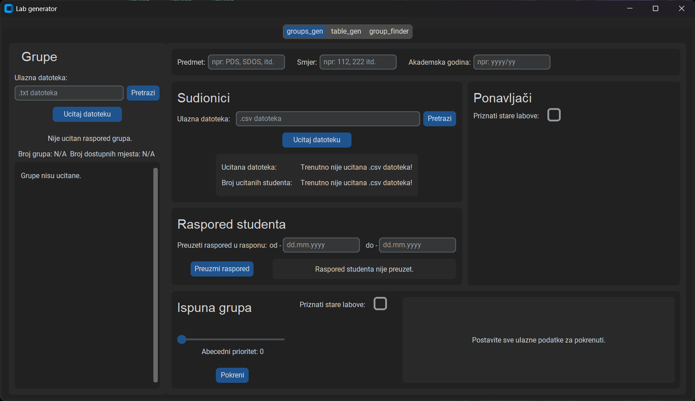

<a id="readme-top"></a>

# Lab-Generator

<details>
  <summary>Sadrzaj</summary>
  <ol>
    <li><a href="#opis-programa">Opis programa</a></li>
    <li><a href="#instaliranje-programa">Instaliranje programa</a></li>
    <li>
      <a href="#koristenje">Koristenje</a>
      <ul>
        <li><a href="#priprema-ulaznih-podataka">Priprema ulaznih podataka</a></li>
        <li><a href="#program">Program</a></li>
      </ul>
    </li>
    <li><a href="#roadmap">Roadmap</a></li>
  </ol>
</details>

## Opis programa

Cilj programa je olaksati stvaranje rasporeda za nastavu na FESBu.

Za rad programa korisnik mora unijeti zeljeni raspored grupa i listu studenta koju preuzme sa sustava merlin. Zatim program preuzima vec postojece rasporede za svakog studenta kako bi onda popunio sve grupe izbjegavajuci preklapanja.

U planu je nadogradnja programa sa funcijom za pronalazak termina nadoknada i potencijalno pronalazak termina za cijeli predmet.

## Instaliranje programa

1. Preuzeti program za poveznie [Releas](https://github.com/skmhaupt/Lab-Generator)
2. unzip
3. .exe kratica

<!--
<p align="right">(<a href="#readme-top">back to top</a>)</p>
-->

## Koristenje

### Priprema ulaznih podataka

Za ispravni rad korisnik mora pripremiti dvije datoteke:

* txt datoteka sa rasporedom grupa

U txt datoteci korisnik mora navesti sve grupe koje zeli ispuniti. Svaka grupa se navodi u novom redu u datoteci. Grupe se navode na sljedeci nacin:

```text
Grupa, dan, termin, dvorana, broj mjesta
Za dan se mora navesti jedna od sljedecih opcija: PON, UTO, SRI, ČET, PET

primjer:
G1, PON, 09:30 - 11:00, B419, 12
G2, PON, 11:00 - 12:30, B419, 12
G3, SRI, 12:30 - 14:00, B419, 12
```

* csv datoteka sa listom svih studenta

U csv datoteci se nalazi lista svih studenta kojima ce se ispuniti zadane grupe. Ona se preuzima sa sustava Merlin. Postupak preuzimanja datoteke je prikazan na sljedecoj slici.

1. U prozoru za sudionike predmeta primjeniti filter za izdvojiti sve studente.
2. Na dnu stranice odabrati sve korisnike.
3. Na dnu stranice po 'S odabranim korisnicima...' odabrati 'Zarezima odvojene vrijednosti (.csv)'
4. Datoteka se sad nalazi u direktoriju preuzimanja pod imenom 'courseid_#_participants.csv'


<p align="right">(<a href="#readme-top">back to top</a>)</p>

---

### Program

#### Grupe


