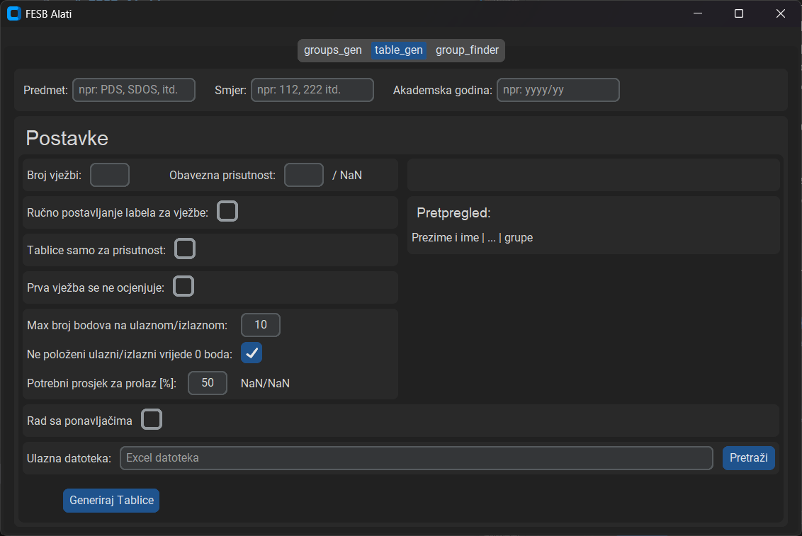
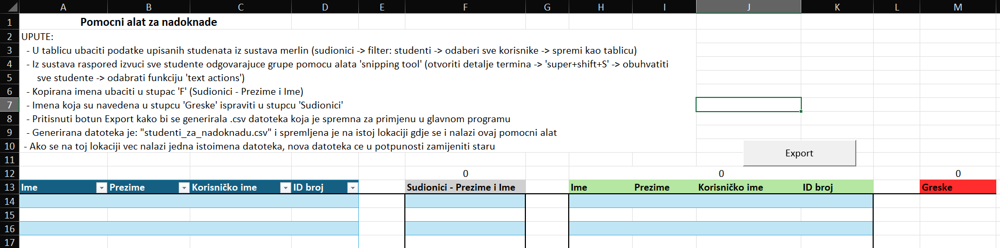

<a id="readme-top"></a>

# Lab-Generator

<details>
  <summary>Sadrzaj</summary>
  <ol>
    <li><a href="#opis-programa">Opis programa</a></li>
    <li><a href="#instaliranje-programa">Instaliranje programa</a></li>
    <li><a href="#poznate-greške">Poznate greške</a></li>
    <li><a href="#u-planu">U planu</a></li>
    <li>
      <a href="#generator-grupa">Generator grupa</a>
      <ul>
        <li><a href="#priprema-ulaznih-podataka-za-ispunu-grupa">Priprema ulaznih podataka</a></li>
        <li><a href="#generator-grupa-1">Generator grupa</a>
          <ul>
            <li><a href="#grupe">Grupe</a></li>
            <li><a href="#sudionici">Sudionici</a></li>
            <li><a href="#raspored-studenata">Raspored studenata</a></li>
            <li><a href="#ispuna-grupa">Ispuna grupa</a></li>
          </ul>
        </li>
      </ul>
    </li>
    <li><a href="#generator-lab-tablica">Generator lab tablica</a></li>
    <li><a href="#nadokande">Nadoknade</a></li>
    <!-- <li><a href="#roadmap">Roadmap</a></li> -->
  </ol>
</details>

## Opis programa

Ovaj program sadrži skup pomočnih alata kojima se nastoji olakšati priprema nastave za FESB. Trenutno sadrži alate za pripremu grupa, generiranje lab tablica (sa opcijom evidentiranja ponavljača) i pronalaska termina za nadoknade. 

Kod alata za pripremu grupa korisnik unosi željeni raspored grupa i listu studenata. Zatim program preuzima postojeće rasporede za svakog studenta kako bi onda popunio sve grupe izbjegavajući preklapanja. U slučaj neuspješnog razvrstavanja dostupne su informacije o pogreškama koje olakšavaju ispravljanje rasporeda.

Generiranje lab tablica se može koristiti kao nastavak na prvi alat, ali i kao zasebni alat koji se može primjeniti na rezultat merlin ankete za lab grupe.

Alat za nadoknade omogučava jednostavno pronalaženje termina u kojima su svi studenti dostupni.

Sustav za preuzimanje rasporeda studenata ('src/Raspored_scraping') je napravio Stipe Jurković (Stipe.Jurkovic.00@fesb.hr)

## Instaliranje programa

Windows:
1. Preuzeti 'Lab_Generator-v1.0.1-alpha.zip' sa poveznice [Release](https://github.com/skmhaupt/Lab-Generator/releases/tag/v1.0.1-alpha).
2. Rraspakirati preuzeti direktorij.
3. Program se pokreće otvaranjem 'Lab_Generator-v1.0.0-alpha.exe' datoteke
4. Po želji napraviti poveznicu za 'Lab_Generator-v1.0.0-alpha.exe' datoteku na radnu površinu.

<!-- ### Priprema iz izvornih podataka

1. Preuzeti 'Source code' sa poveznice [Release](https://github.com/skmhaupt/Lab-Generator/releases/tag/v1.0.0-alpha).
2. Rraspakirati preuzeti direktorij.
3. 
```
pyinstaller --noconfirm --onedir --windowed --add-data "C:\Users\sebas\AppData\Roaming\Python\Python313\site-packages;customtkinter/" "Lab_Generator_gui.py"
```
4. Po želji napraviti povežnicu za radnu površinu. -->

<!--
<p align="right">(<a href="#readme-top">back to top</a>)</p>
-->

## Poznate greške

> [!NOTE]
> ~~Pri pokretanju raznih sekcija istovremeno moze nastupiti pogreska. Npr. ako se pokrene ućitavanje grupa dok se već radi preuzimanje studentskih rasporeda nastane nepovratna greška. - Trenutno nema mjera za ispravljanje pogreške te ako se slučajno izazove se predlaže ponovno preuzimanje programa. - U što kračem roku će biti dostupna verzija sa privremenim rješenjem.~~ - Pokretanje različitih sekcija istovremeno je blokirano. - U budućnosti se možda napravi rješenje za grešku.

## U planu

- [x] Funkcija za pronalaženje termina nadoknada
- [x] Funkcija za generiranje tablica za lab vježbe
- [ ] Bolje pračenje koraka preuzimanja studentskih rasporeda
- [ ] Tablice koje su samo za evidenciju prisutnosti (bez bodova)
- [ ] Novi UI

<p align="right">(<a href="#readme-top">povratak na vrh</a>)</p>

## Generator grupa

### Priprema ulaznih podataka

Za ispravni rad korisnik mora pripremiti dvije datoteke:

* txt datoteka s rasporedom grupa

U txt datoteci korisnik mora navesti sve grupe koje želi ispuniti. Svaka grupa se navodi u novom redu u datoteci. Grupe se navode na sljedeći način:

```text
Grupa, dan, termin, dvorana, broj mjesta
Za dan se mora navesti jedna od sljedećih opcija: PON, UTO, SRI, ČET, PET

primjer:
G1, PON, 09:30 - 11:00, B419, 12
Grupa2, PON, 11:00 - 12:30, A100, 40
G_3, SRI, 12:30 - 14:00, B419, 8
```

* csv datoteka s listom svih studenta

U csv datoteci se nalazi lista svih studenata s kojima će se ispuniti zadane grupe. Ona se preuzima sa sustava Merlin. Postupak preuzimanja datoteke je prikazan na sljedećoj slici i opisan je kroz sljedeče korake:

1. U prozoru za sudionike predmeta primijeniti filter za izdvojiti sve studente.
2. Na dnu stranice odabrati sve korisnike.
3. Na dnu stranice pod 'S odabranim korisnicima...' odabrati 'Zarezima odvojene vrijednosti (.csv)'
4. Datoteka se sad nalazi u direktoriju 'downloads (preuzimanja)' pod imenom 'courseid_#_participants.csv'


<p align="right">(<a href="#readme-top">povratak na vrh</a>)</p>

### Generator grupa


#### Grupe

Za učitati grupe prvo je potrebno zadati .txt datoteku. Vise informacija o pripremi datoteke se može naći u poglavlju ['Priprema ulaznih podataka'](#priprema-ulaznih-podataka).

Datoteka se bira preko botuna 'Pretrazi'. Nakon što se odabere željenu datoteku, potrebno ju je učitati pomoću botuna 'učitaj datoteku'. Ako je zadana datoteka ispravna, ispod botuna će biti prikazani zadani podatci te se može provjeriti ako je sve pravilno učitano. Ako neka grupa nije pravilno zadana ona neće biti prikazana.

Na slici ispod je prikazan primjer pravilno učitane datoteke. S lijeve strane je .txt datoteka s podatcima, a s desne je prikaz sekcije iz programa s pravilno učitanim grupama.


<p align="right">(<a href="#readme-top">povratak na vrh</a>)</p>

### Sudionici

Za učitati studente prvo je potrebno zadati .csv datoteku. Vise informacija o pripremi datoteke se može naći u poglavlju ['Priprema ulaznih podataka'](#priprema-ulaznih-podataka).

Datoteka se bira pomoću botuna 'Pretrazi'. Nakon što se odabere željenu datoteku, potrebno ju je učitati pomoću botuna 'ucitaj datoteku'. Ako je zadana datoteka ispravna, ispod botuna će biti prikazani zadani podatci te se može provjeriti ako je sve pravilno učitano.

Na slici ispod je prikazan primjer pravilno učitane datoteke. Prvo je prikazana .csv datoteka s podatcima, te je ispod prikazana sekcije iz programa s pravilno učitanim studentima.


<p align="right">(<a href="#readme-top">povratak na vrh</a>)</p>

### Raspored studenata

Za preuzeti raspored studenata potrebno je zadati raspon datuma unutar kojeg se preuzima raspored i listu studenata. Zadavanje liste studenata je već opisano u prethodnom poglavlju ['Sudionici'](#sudionici). Početni i krajnji datum se zadaju u za to predviđena polja.

Nakon što su potrebni podatci zadani, preuzimanje rasporeda se pokreće s botunom 'Preuzmi raspored'. Preuzimanje rasporeda može potrajati duže vremena (nekoliko minuta) ovisno o količini studenta i o rasponu datuma.

> [!TIP]
> Ako se kao raspon zada cijeli semestar, pri popunjavanju grupa će se uzeti u obzir i sva predavanja koja se ne ponavljaju redovito (Npr. već unaprijed pripremljene nadoknade).

Na slici ispod je vidljiv prikaz preuzimanja rasporeda, prikaz preuzetog rasporeda s mogućim pogreškama i prikaz s ispravno preuzetim rasporedom. Slučaj preuzetog rasporeda s mogućim pogreškama nastupa kad program ne uspije preuzeti raspored za nekog studenta ili/i ako je neki preuzeti raspored prazan. Botunom 'Preuzmi detalje' se može preuzeti excel datoteka koja sadrži listu studenata kod kojih je nastupila pogreška.


<p align="right">(<a href="#readme-top">povratak na vrh</a>)</p>

### Ponavljači

> [!TIP]
>Ova funkcija se može koristiti i ako ponavljači nemaju pravo biti oslobođeni labova jer može poslužiti kao evidencija.

Rad sa ponavljačima je namjenjen za izdvajanje studenata koji su oslobođeni od polaganja lab vježbi. Time se pri koraku ispunjavanja grupa zanemaruju oslobodeni studenti te če u grupe biti upisani samo studenti koji moraju odradit lab vježbe. 

Za rad sa ponavljačima je portebna tablica od samo prošle akademske godine. Korisnik bira postavke po kojima definira pravila za oslobađanje studenata (postavke su vidljive na slici isopd). Prva postavka, ukoliko je odabrana, definira da će student biti oslobođen ako je prošle akademske godine položio vježbe. Druga postavka definira koliko puta student mora položiti lab vježbe da bi bio oslobođen neovisno o prvoj postavci. 

Npr: opcija jedan je iskljucena i opcija dva je jednaka 2: student je oslobođen ako je barem dva puta vec položio lab; ukoliko je ovo studentu tek drugi upis predmeta ne može biti oslobođen čak i ako je položio prošle godine.

Ovim postavkama se može postaviti da niko ne može biti oslobođen lab vježbi, što je korisno ukoliko se ova funkcija želi koristiti samo kao evidencija o ponavljačima.

Datoteka koja se generira je 'predmet-smjer-akad.god.-ponavljaci.xlsx' excel datoteka. Sadrži podatke o ponavljačima te se može provjeriti tko je sve oslobođen, po potrebi se podatci mogu i urediti. Ima i jedan stupac koji je namjenjen za naznačiti studente koji žele odraditi vježbe iako su oslobođeni. Daljnja primjena datoteke je objašnjena u poglavljima: ['Ispuna grupa'](#ispuna_ponavljaci_anchor_point) i ['Generator lab tablica'](#generator-lab-tablica). 


<p align="right">(<a href="#readme-top">povratak na vrh</a>)</p>

### Ispuna grupa

Ispuniti grupe nije moguće sve dok nisu spremni svi potrebni podatci (grupe, studenti, rasporedi studenata). Ispunjavanje grupa se pokreće botunom 'pokreni'. Ako je zadani ukupni broj dostupnih mjesta po grupama manji od broja zadanih studenata, pri pokretanju će program izbaciti upozorenje i pitati ako korisnik želi nastaviti.

__abecedni prioritet:__
Prije pokretanja ispune može se zadati razina abecednom prioritetu. Abecedni prioritet definira koji studenti imaju prioritet pri popunjavanju grupa. Ako se zada vrijednost od '100' onda se studenti biraju po striktno abecednom redoslijedu prezimena. Ako se zada vrijednost od '0' onda se studenti biraju striktno po kriteriju količine odgovarajućih grupa (dostupnih mjesta). Npr. ako za studenta A ima 12 slobodnih mjesta, a studenta B ima 8 slobodnih mjesta, student B ima prioritet i biti će razvrstan prije studenta A.

> [!TIP]
> Ako abecedno sortiranje nije uspješno preporučuje se jednom pokrenuti s abecednim prioritetom od '0' jer postoji mogućnost da s odabranim grupama uopće nije moguće razvrstati studente. Nakon uspješnog razvrstavanja može se postepeno povećavati abecedni prioritet.

Ako su svi studenti uspješno razvrstani po grupama korisnik može preuzeti excel datoteku s popunjenim grupama. Ako nisu svi studenti uspješno razvrstani po grupama korisnik može, pored standardne datoteke s rezultatom, preuzeti i excel datoteku s dodatnim informacijama o pogreškama.


<a name="ispuna_ponavljaci_anchor_point"></a>
__rad sa ponavljačima:__
Pri radu sa ponavljačima je prije ispune grupa potrebno priložiti datoteku 'predmet-smjer-akad.god.-ponavljaci.xlsx'. Time studenti koji su oslobođeni neče biti svrstani u grupe.


<p align="right">(<a href="#readme-top">povratak na vrh</a>)</p>

## Generator lab tablica

Ovom funkcijom se generiraju tablice za evidenciju lab vježbi. Za rad je potrebna datoteka generirana prethodnom sekcijom koja sadrži podatke o popunjenim groupama. Korisnik mora definirati potrebne postavke poput broja vježbi, potrebne prisutnosti, bodovanje, itd. Ukoliko se koristi rad sa ponavljačima potrebna je i datoteka generirana sekcijom ['Ponavljači'](#ponavljači). 

Također se može, umjesto datoteke iz prethodne sekcije, koristiti i datoteka sa merlina koja se dobije ako su studenti birali grupe kroz anketu.

Pretpregled prikazuje kako će izgledati zaglavlje osnovne tablica sa bodovima. Ukoliko korisnik zada 'broj vježbi = 3', u pretpregledu ce se prikazati 'Prezime i ime | Lab1 | Lab2 | Lab3 | Grupe'. Ukoliko korisnik ne želi koristiti labele 'Lab1, Lab2,...' ima opciju ručnog postavljanja labela, ali mora voditi računa o tome da se broj labela poklapa sa brojem vježbi. 

Postavka 'Prva vježba se ne ocjenjuje:' se koristi ako na prvoj vježbi nema provjere znanja, odnosno kad je potrebna samo prisutnost. Time vježba jedan ne nosi bodove i ne ulazi u prosjek, ali se racuna pri potrebnoj prisutnosti. Ako se uključi ova postavka pojavit če se druga postavka za 'lab0'. Ova druga postavka je korisna ukoliko se koristi takozvana 'nulta vježba'. U slučaj korištenja ove druge postavke, če se u excel tablici ubaciti novi stupac 'Lab0'. Novi 'Lab0' stupac je sad taj koji se ne ocjenjuje umjesto 'Lab1' stupac. __Postavka za 'lab0' nije dostupna ukoliko se ručno postavljaju labele.__ 

Postavka 'Ne položeni ulazni/izlazni vrijede 0 boda' definira ako bodovi ne položenih vježbi ulaze u prosjek kao 0 boda ili kao onoliko boda koliko je student dobio (npr. 2/10). 

> [!TIP]
> Ako nema ulaznih/izlaznih provjera znanja može se pod max broj bodova na ulaznom/izlaznom staviti '1' (1 = prisutan, 0 = odsutan). 



<p align="right">(<a href="#readme-top">povratak na vrh</a>)</p>

## Nadokande

Ovom funkcijom se traže termini za nadoknade. Potrebna je ulazna .csv datoteka sa listom studenata kao i kod funkcije za [generiranje groupa](#priprema-ulaznih-podataka). Lista se može izvuči iz generiranih tablica za labove ili sa merlina. Ako se preuzima sa merlina onda je potrebno izdvojiti podatke onih studenata koji su dio grupe za koju se traži termin. U tu svrhu je dostupan pomocni alat koji se moze preuzeti iznad funkcije za nadoknade.

Prije pokretanja korisnik prvo zadaje raspon datuma unutar kojeg se želi naći termin za nadoknadu. Zatim mora definirati trajanje termina. Mora zadati broj školskih sata i naznačiti ako termin sadrži pauze od po 15 min. Kad program dovrši sa radom se datoteka sa rezultatima može nači u direktoriju 'downloads (preuzimanja)'. Ime datoteke je sljedeceg oblika: '_predmet_-_smjer_-_akad.god._-dostupni_termini.xlsx'.


Preuzeta pomočna datoteka se nalazi u direktoriju 'downloads (preuzimanja)' pod imenom 'Tablica_za_izvlacenje.xlsm'. Pri prvom otvaranju datoteke je potrebno dozvoliti rad botuna (macro naredbi). Na slici ispod je prikazano gdje se daje dozvola za rad botuna. 


Kratke upute se mogu naći u datoteci. Predlaže se držanja sljedećih koraka za jednostavno korištenje: 

 1. Preuzeti podatke svih studenata sa merlina kao što je opisano pod ['Priprema ulaznih podataka'](#priprema-ulaznih-podataka) s jedinom razlikom da se preuzmu kao excel datoteka. Ukoliko je datoteka već preuzeta kao .csv datoteka, onda se ta datoteka može otvoriti u excelu koji će odraditi konverziju. 
 1. Iz preuzete datoteke sa podatcima studenata kopirati odgovarajuće stupce u prva četri stupca alata.
 1. Otvoriti FESB-ov sustav [raspored](https://raspored.fesb.unist.hr/raspored/studiji), pronaći termin za koji se traži nadoknada i otvoriti detalje (za otvoriti detalje korisnik mora biti prijavljen u sustav raspored)
 1. Pokrenuti alat 'snipping tool' (kratica: win+shift+S) i naznačiti studente, iskoristiti funkciju 'Text actions' unutar 'snipping tool' alata i kopirati sva imena u stupac 'Sudionici' excel alata. (ukoliko se ne mogu pokriti svi studenti isprve bit će potrebno ponoviti ovaj korak dok se ne kopiraju svi studenti)
 1. Pregledati stupac 'Greske' u excel alatu. Ovaj stupac sadrži ona imena iz stupca 'Sudionici' koja alat nije moga pronaći u tablice studenata(prva četiri stupca). Provjeriti ako je sa imenima u pitanju nastala pogreška prilikom kopiranja (uglavnom je greška u jednom slovu) i ispraviti ih u stupcu 'Sudionici'.
 1. Ako je stupac sa greškama prazan može se pokrenuti export sa pritiskom na botun 'Export'. Generira se datoteka 'studenti_za_nadoknadu.csv' koja če se nalaziti na istoj lokaciji gdje se nalazi i ovaj exel alat.



<p align="right">(<a href="#readme-top">povratak na vrh</a>)</p>